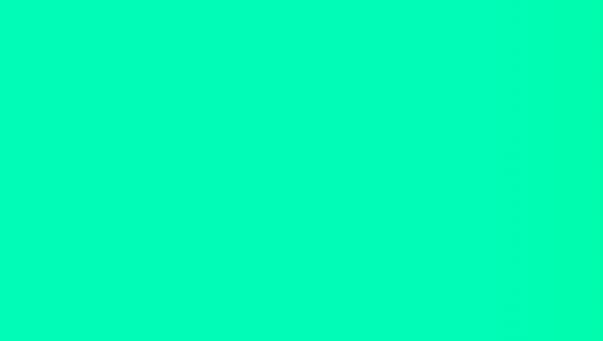

## Hi there 👋

👋 Hi! I'm Rizki Ramadhan Lestariono, an aspiring Data Analyst from Jakarta, Indonesia, currently studying at Hacktiv8 Data Science Bootcamp. 

🔥 I'm passionate about data analytics, exploratory data analysis (EDA), and data visualization to support data-driven decision making.

✍ With a background in UI/UX design and software testing, I bring a unique perspective to data presentation. I'm skilled in SQL, Python, and visualization tools like Tableau for effective data storytelling.

📈 I've worked as a freelancer at Jokiweb.like where I collaborated with developers on UI/UX design from wireframing to prototyping, built websites using WordPress and Framer, and performed manual testing on developed applications.

🚀 I enjoy creating business intelligence reports and am constantly improving my skills in data-driven decision making.

🎓 I hold an S1 in Teknik Informatika from Universitas Pamulang and am currently enhancing my skills through a full-time Data Science Bootcamp.

🎁 I'm always enthusiastic about learning more in the world of data analytics and developing my skills in business intelligence.

📧 You can reach me at rizkiramarama@gmail.com or check out my work at my GitHub and Portfolio.

😄 Besides data, I enjoy building projects, learning new technologies, and applying my combined skills in UI/UX design and data analysis to create impactful solutions!

 
 

#  Sponsor me 

<!--
**rizkeyyy/rizkeyyy** is a ✨ _special_ ✨ repository because its `README.md` (this file) appears on your GitHub profile.

Here are some ideas to get you started:

- 🔭 I’m currently working on ...
- 🌱 I’m currently learning ...
- 👯 I’m looking to collaborate on ...
- 🤔 I’m looking for help with ...
- 💬 Ask me about ...
- 📫 How to reach me: ...
- 😄 Pronouns: ...
- ⚡ Fun fact: ...
-->
